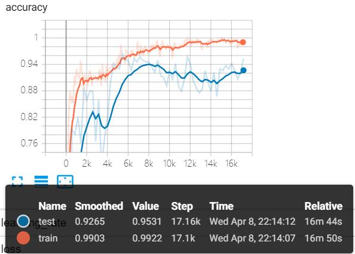

# 深度学习：homework-01-svhn

## 1 实现环境

- python 3.7.3
- tensorflow 1.13.1
- tensorflow-gpu 1.14.0
- tensorboard 1.14.0
  - Smoothing = 0.8

## 2 baseline

### 2.1 修改

相比最初的 baseline，我主要有如下几处修改。

```python
baseline/dataset.py

 class Dataset():
-    dataset_path = '/root/dataset/SVHN'
+    dataset_path = '../dataset/'
```

- 此处是正常的路径变动。

```python
baseline/regularizer.py

- reg_loss = standard_ops.reduce_sum(math_ops.pow(math_ops.abs(weigths), p))
+ reg_loss = standard_ops.reduce_sum(math_ops.pow(math_ops.abs(weights), p))
  return standard_ops.multiply(my_scale, reg_loss, name=name)
```

- 此处是一个拼写错误 `weights`，导致程序无法运行。

```python
baseline/common.py

- weight_decay = 1e-10
+ weight_decay = 5e-4

- use_extra_data = True
+ use_extra_data = False
```

-  `use_extra_data = False` 是因为我没有 GPU，不能支持大数据集的训练，所以这次训练我没有使用 extra_32*32.mat 数据集。
- 原本 baseline 中的 `weight_decay ` 过小，后续题目中的训练出现了过拟合情况。经过查询相关资料和本地测试，最终修改为 `weight_decay = 5e-4` ，同时保留 `weight_decay = 1e-10` 作为对照组。

### 2.2 运行情况

左侧 `weight_decay = 5e-4`，右侧 `weight_decay = 1e-10`。

<center class="half">
    
    
</center>  

## 3 Q1: Finding alternatives of softmax

<center class="half">
    
</center>  

### 3.1 实验准备

#### 3.1.1 baseline 分析

对于本题的 baseline，在 softmax 之后，输入的加权和前面多了一个 exp，后续求交叉熵的时候，通过了一个 log，整个网络的优化函数，变成了一个近似的线性函数。 

softmax 代入到交叉熵中进行计算时，这个损失函数是一个凸函数，并且 loss 越大，其梯度越大，便于反向传播实现快速收敛。

#### 3.1.2 代码修改

```python
baseline/train.py

def main():
    parser = argparse.ArgumentParser()
    parser.add_argument('-c', '--continue', dest='continue_path', required=False)         parser.add_argument('-l', '--loss', default=loss_name)
    args = parser.parse_args()
```

本次实验主要通过修改 `loss_name` 得到实验结果。

- `['softmax', 'abs-max', 'square-max', 'plus-one-abs-max', 'non-negative-max']`

### 3.2 实验分析

### 3.2.1 abs-max

左侧 `weight_decay = 5e-4`，右侧 `weight_decay = 1e-10`。

<center class="half">
    
</center>  

- 从定义来看，abs-max 是一个偶函数，对于 logits 中绝对值高的输出值经过该方法后会有较大的概率。
- abs-max 代入到交叉熵函数中进行计算时，它不是凸函数，所以收敛时间较慢，需要更长的时间才能收敛。
- 而当 `weight_decay` 较小的时候，这种影响更大，其训练精度始终在 0.5 左右徘徊。

### 3.2.2 square-max

左侧 `weight_decay = 5e-4`，右侧 `weight_decay = 1e-10`。

<center class="half">
    
</center>  

- 与 abs-max 类似，square-max 同样是一个偶函数。
- 所以当其代入到交叉熵函数中进行计算时，依然不是凸函数，但是由于相对于 abs-max 方法，square-max 的梯度是它的 2 倍，所以 square-max 的收敛速度更快一些。
- 同样的，当 `weight_decay` 较小的时候，它的效果仍然不好，其训练精度一度达到 0.8，然后下跌到 0.6 左右。

### 3.2.3 plus-one-abs-max

左侧 `weight_decay = 5e-4`，右侧 `weight_decay = 1e-10`。

<center class="half">
    
</center>  

- plus-one-abs-max 是这 4 个替代函数当中唯一的在一种情况下精度高于 softmax 的方法。
- 具体分析，plus-one-abs-max 可能由于在对输入取绝对值后加 1 实现了平滑效果，避免了由于分子分母的 0 值导致损失函数出现异常。

### 3.2.4 non-negative-max

左侧 `weight_decay = 5e-4`，右侧 `weight_decay = 1e-10`。

<center class="half">
    
</center>  

- non-negative-max 的普适性是最好的，它的 accuracy 在两种情况下均能达到类似 softmax 的水平。
- 从上图可以发现，训练精度持续增高，在 `weight_decay` 较高的情况下，随着迭代次数增加，模型很有可能继续提高精度。
- 具体分析，non-negative-max 实际上是 relu 函数的一个变形，它将所有小于 0 的预测值都设置为 0，而大于 0 的预测值将获得较高的概率.
- 因为我们设置了 `loss_reg` 来代替 0，所有在反向传播的过程，对小于 0 的输出值我们仍然能够进行反向传播，不会出现消失。

<div STYLE="page-break-after: always;"></div>

### 3.3 实验总结

| Method           | Test-Accuracy(5e-4) | Test-Accuracy(1e-10) |
| ---------------- | ------------------- | -------------------- |
| softmax          | 94.53%              | 96.09%               |
| abs-max          | 94.53%              | 55.86%               |
| square-max       | 93.36%              | 62.89%               |
| plus-one-abs-max | 95.31%              | 56.64%               |
| non-negative-max | 94.53%              | 94.53%               |

- 当 `weight_decay = 5e-4`时，plus-one-abs-max 和 non-negative-max 都能起到替代 softmax 的作用，而且 plus-one-abs-max 的性能高于 softmax。
- 当 `weight_decay << 5e-4`时，non-negative-max 替代 softmax 的普适性更好。

## 4 Q2: Regression vs Classification

> Change cross entropy loss to the square of euclidean distance between model predicted probability and one hot vector of the true label.

### 4.1 实验准备

#### 4.1.1 baseline 分析

交叉熵损失函数经常用于分类问题中，由于交叉熵涉及到计算每个类别的概率，所以交叉熵几乎每次都和 softmax 函数一起出现。 随着预测概率偏离实际标签，交叉熵损失会逐渐增加。 

- 优点
  - 交叉熵计算损失是一个凸优化问题，用梯度下降求解时，凸优化问题有很好的收敛特性。
- 缺点
  - 交叉熵损失函数只关心对于正确标签预测概率的准确性，忽略了其他非正确标签的差异，导致学习到的特征比较散。

#### 4.1.2 代码修改

```python
diff -u baseline/train.py q2/train.py

-    loss = tf.losses.softmax_cross_entropy(label_onehot, logits) + loss_reg
+    loss = tf.losses.mean_squared_error(label_onehot, logits) + loss_reg
```

本次实验主要通过对损失函数进行修改，将原本的交叉熵损失函数修改为预测概率和真实标签的独热向量的欧式距离。

### 4.2 实验分析

`weight_decay = 5e-4`，左侧 `cross entropy loss` , 右侧 `square of euclidean distance`。

<center class="half">
    
</center>  

`weight_decay = 1e-10`，左侧 `cross entropy loss` , 右侧 `square of euclidean distance`。

<center class="half">
    
</center>  

- 相比于 cross entropy，MSE 在本次实验中
  - 收敛速度更快
  - 测试精度有略微的提高
  - 不容易过拟合

### 4.3 实验总结

| Method                       | Test-Accuracy(5e-4) | Test-Accuracy(1e-10) |
| ---------------------------- | ------------------- | -------------------- |
| cross entropy loss           | 94.53%              | 96.09%               |
| square of euclidean distance | 94.92%              | 95.7%                |

- 理论上来说，用 MSE 计算 loss 的问题在于，通过 Softmax 输出的曲线是波动的，有很多局部的极值点。 即非凸优化问题，而 cross entropy 计算 loss 是一个凸优化问题。所以  cross entropy 的效果应该比 MSE 更好。
- 然而在本次实验中， MSE 相对于 cross entropy，它反而发挥出了更好的效果，这是一个比较矛盾的地方。
- 个人猜测是由于我没有使用 extra_32*32.mat 数据集，数据量较小，无法体现 cross entropy 的优势。

## 5 Q3: Lp pooling

### 5.1 实验准备

#### 5.1.1 baseline 分析

- 平均池化：
  - 全局信息都有贡献时，提取出平均特征，会导致特征差异减小。
  -  减少卷积层参数误差造成估计均值的偏移。 
- 最大池化：
  - 提取出特征差异最大的值。
  - 减少邻域大小受限造成的估计值方差增大。

#### 5.1.2 代码修改

本次实验将所有的 pooling layers 都换成了 Lp pooling：

```python
diff -u baseline/model.py q3/model.py
 
+ elif mode == 'LP':
+     x = self._lp_pool(inp, ksize=ksize, strides=[1, stride, stride, 1], padding=padding, data_format='NHWC', p=4)
      return x
```

其中，Lp pooling 的公式为：

$$O = (\sum\sum I(i, j)^P ×G(i, j))^{1/P}$$

一个例子：

<center class="half">
    
</center>  

Lp-pooling 与往常所使用的 max-pooling 和 avg-pooling 有一定差别，它更像是一个卷积核为高斯核的卷积层，从而实现池化的功能。

其具体实现如下：

```python
def _lp_pool(self, inp, ksize, strides, padding, data_format, p):
    gauss_kernel = np.multiply(cv2.getGaussianKernel(ksize, 0.8), np.transpose(cv2.getGaussianKernel(ksize, 0.8)))
    gauss_kernel = tf.constant(gauss_kernel, shape=[ksize, ksize, 1, 1], dtype=tf.float32)
    res = [tf.nn.conv2d(input=tf.expand_dims(inp_p, axis=-1), filter=gauss_kernel, strides=strides, padding=padding, data_format=data_format) for inp_p in tf.unstack(tf.pow(inp, p), axis=-1)]
    return tf.pow(tf.concat(res, axis=-1) + 1e-10, 1.0/p)
```

对于卷积运算，[whc] 的特征，加上 [kkc] 的卷积核进行卷积，输出的是一张 [wh1] 的特征图。

所以这里我做了一个拆分，将[whc] 的特征按照 channel 拆分为 c 个 [wh1] 的特征，对每一个 channel 的特征分别进行卷积，最后再拼接起来，完成池化的效果。

### 5.2 实验分析

`weight_decay = 5e-4`，$P=-2,-1,1$

<center class="half">
    
</center>  

`weight_decay = 5e-4`，$P=2,3,4$

<center class="half">
    
    
</center>  

### 5.3 实验总结

| Method   | Test-Accuracy |
| -------- | ------------- |
| baseline | 94.53%        |
| $P = -2$ | 94.53%        |
| $P = -1$ | 94.14%        |
| $P = 1$  | 92.63%        |
| $P = 2$  | 94.14%        |
| $P = 3$  | 94.92%        |
| $P = 4$  | 14.06%        |

- lp-pooling 相比于 max-pooling，测试精度有一个明显的提升，$-2≤P≤3$ 时，模型都有一个很好的效果。
- $P=4$ 时的测试效果很差，是由于迭代过程中会出现 loss=nan 的情况，原因应该是 4 次运算导致结果溢出。

<center class="half">
    
</center>  

## 6 Q4: Regularization

### 6.1 实验准备

#### 6.1.1 baseline 分析

L2 正则化：

- 正则化计算起来很方便。
- 不会使输出稀疏，不像 L1 正则化把不重要的特征直接置零。
- 有唯一解。
- 主要用来防止过拟合，并且让优化求解变得稳定且快速。

#### 6.1.2 代码修改

Q4.1 主要是将原本的 l2_regularizer 替换为 regularizer.lp_regularizer，尝试不同 P 值的 lp 正则化。

```python
diff -u baseline/model.py q4.1/model.py
 
 class Model():
         self.weight_init = tf_contrib.layers.variance_scaling_initializer(factor=1.0,
                                 mode='FAN_IN', uniform=False)
         self.bias_init = tf.zeros_initializer()
-        self.reg = tf_contrib.layers.l2_regularizer(config.weight_decay)
+        self.reg = regularizer.lp_regularizer(config.weight_decay, p=4)
```

Q4.2 在 Q4.1 的基础上，将正则化项置为负。

```python
diff -u baseline/regularizer.py q4.2/regularizer.py

-      return standard_ops.multiply(my_scale, reg_loss, name=name)
+      return -standard_ops.multiply(my_scale, reg_loss, name=name)
```

### 6.2 实验分析

#### 6.2.1 Try Lp regularization with different p

`weight_decay = 5e-4`，$P=-2,-1,0.5$

<center class="half">
    
</center>  

`weight_decay = 5e-4`，$P=-1,2,3$

<center class="half">
    
</center>  

`weight_decay = 5e-4`，$P=4,5,100$

<center class="half">
    
</center>  

#### 6.2.2 Set Lp regularization to a minus number

`weight_decay = 5e-4`，$P=-2,-1,1$

<center class="half">
    
</center>  

`weight_decay = 5e-4`，$P=2,3,4$

<center class="half">
    
</center>  

#### 6.2.3 正负对比

左侧 lp_reg 为正，右侧 lp_reg 为负，`weight_decay = 1e-10`

$P=1$

<center class="half">
    
</center>  

$P=2$
<center class="half">
    
</center>  

<div STYLE="page-break-after: always;"></div>

$P=3$

<center class="half">
    
</center>  

$P=4$

<center class="half">
    
</center>  

### 6.3 实验总结

#### 6.3.1 Try Lp regularization with different p

| Method    | Test-Accuracy |
| --------- | ------------- |
| baseline  | 94.53%        |
| $P = -2$  | 08.03%        |
| $P = -1$  | 85.94%        |
| $P = 0.5$ | 14.06%        |
| $P = 1$   | 94.14%        |
| $P = 2$   | 94.92%        |
| $P = 3$   | 96.09%        |
| $P = 4$   | 97.27%        |
| $P = 5$   | 95.31%        |
| $P = 100$ | 94.14%        |

- 负值的运行结果都比较差。
- 当 $P≥1$ 时，随着 P 的增大，测试精度呈现一个先增后降的趋势。
- 当 $P=4$ 时，测试精度最高，因此 L4 正则化在本实验中是最有效的。

#### 6.3.2 Set Lp regularization to a minus number


| Method   | Test-Accuracy | Test-Accuracy(minus number) |
| -------- | ------------- | --------------------------- |
| baseline | 94.53%        |                             |
| $P = -2$ | 08.03%        | 14.06%                      |
| $P = -1$ | 85.94%        | 35.16%                      |
| $P = 1$  | 94.14%        | 78.13%                      |
| $P = 2$  | 94.92%        | 83.98%                      |
| $P = 3$  | 96.09%        | 91.41%                      |
| $P = 4$  | 97.27%        | 92.58%                      |

- 负值的运行结果依旧差。
- 负正则化项对整个神经网络的精度有一定负面影响，这种影响随着 P 的增大而减弱。

两问中 $P=-2$ 时出现的异常，是由于迭代过程中会出现 loss=nan 的情况，原因应该是极小值的平方求倒导致结果过小。

<center class="half">
    
</center>  

#### 6.3.3 weight_decay=1e-10 正负对比
| Method    | Test-Accuracy(positive) | Test-Accuracy(negative) |
| --------- | ------------- | ------------- |
| baseline  | 96.09%  |  |
| $P = 1$   | 95.70% | 96.09% |
| $P = 2$   | 94.92%      | 95.70%  |
| $P = 3$   | 95.31%    | 96.48%  |
| $P = 4$   | 96.09%    | 95.70%  |

- 由于 weight_decay 过小，模型都有一定的过拟合情况。
- P 值的改变相对于 `weight_decay = 5e-4` 时，对结果影响较小。
- lp_reg 的正负结果对整个神经网络的精度几乎没有影响。

