# 深度学习：homework-04-distillation

# 1 实现环境

- python 3.7.3
- numpy 1.16.1
- tensorflow 1.13.1
- tensorflow-gpu 1.14.0
- tensorboard 1.14.0
  - Smoothing = 0.

# 2 背景知识

模型压缩和加速的四个技术是设计高效小型网络、剪枝、量化和蒸馏。蒸馏，就是知识蒸馏，是一种基于“教师-学生网络思想”的训练方法，将高精度的大模型（教师网络，teacher network）的知识迁移到更小的适合部署的模型（学生网络，student network）上，使得学生网络的性能表现如教师网络一般。由于其简单，有效，在工业界被广泛应用。

Knowledge Distillation，简称KD，顾名思义，就是将已经训练好的模型包含的知识(”Knowledge”)，蒸馏("Distill")提取到另一个模型里面去。

采用的具体方法如下：

1. 训练复杂的教师模型（teacher model）：
   - 先用硬目标（hard target），也就是正常的标签（label）训练大模型。
2. 计算软目标（soft target）：
   - 利用训练好的大模型来计算软目标（soft target），也就是大模型“软化后”再经过softmax层的输出。
3. 训练小模型：
   - 在小模型的基础上再加一个额外的软目标（soft target）的损失函数，通过比例参数来调节两个损失函数的比重。
4. 预测：
   - 将训练好的小模型用来进行实验。

本次实验中：

- 使用第一次作业（01-svhn）的 baseline 模型作为教师模型。
- 利用教师模型蒸馏一个量化神经网络，使用离散的值来表示权重和特征。

# 3 教师模型

本实验使用第一次作业（01-svhn）的 baseline 模型作为教师模型。

其运行情况如下：

<center>
    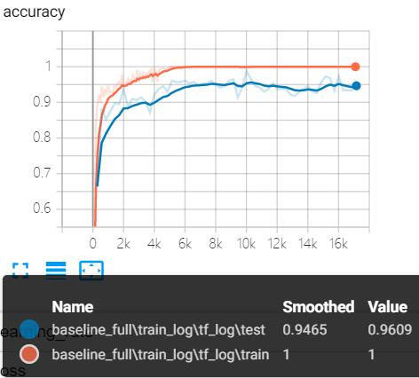
</center>

# 4 利用 gt 训练量化模型

> Run the baseline code and record the test accuracy of the quantized model.

## 4.1 实验设计

本次实验对比两种情况的效果：

- 不利用教师模型，只利用量化神经网络训练。
- 利用教师模型蒸馏量化神经网络。

## 4.2 实验结果

<center>
    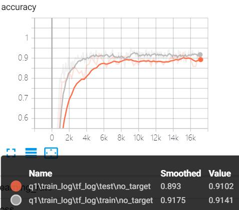
    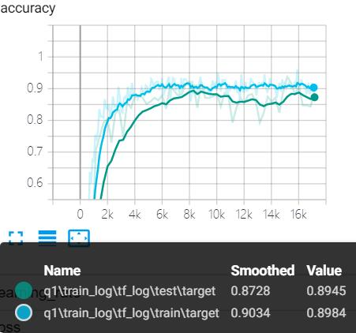
	<div>不利用教师模型 &nbsp&nbsp&nbsp&nbsp&nbsp&nbsp&nbsp&nbsp&nbsp&nbsp&nbsp&nbsp&nbsp&nbsp&nbsp&nbsp&nbsp&nbsp&nbsp&nbsp&nbsp&nbsp&nbsp&nbsp&nbsp&nbsp&nbsp&nbsp&nbsp&nbsp&nbsp 利用教师模型</div>
</center>

<center>
    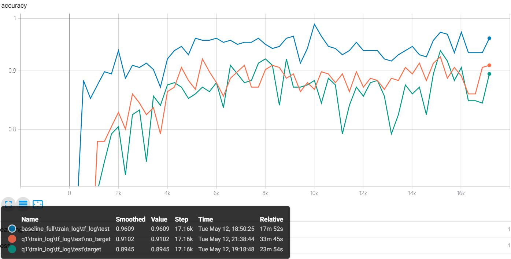
</center>

|                | Test Accuracy | Model Size |
| -------------- | ------------- | ---------- |
| baseline       | 96.09%        | 3.36 MB    |
| 不利用教师模型 | 91.02%        | 1.11 MB    |
| 利用教师模型   | 89.45%        | 1.11 MB    |

## 4.3 实验分析

量化模型通过缩小训练参数的搜索空间，明显地将存储内存降低。

同时，伴随着内存降低的代价是精度的丧失。

# 5 利用教师模型的分类概率训练量化模型

> - Training your teacher model with the configuration of baseline in Homework1/1a.
>
> - Use softmax with temperature  (defined as below) to construct the 'soft' cross entropy loss with target class probabilities generated from the teacher model. Higher value of temperature T produces a softer probability distribution over classes.
>   Notice that the target probabilities are also generated using softmax with the same temperature.
>
>     
>
>     Here   denotes logits for the ith class, temperature and probability for the ith class, respectively.     
>
> - Rerun the training process of the quantized model with different temperature. Analyze how temperature influences the distilled model.

## 5.1 实验设计

我们可以先训练好一个教师模型，然后将教师模型的输出结果 $q$ 作为学生模型的目标，训练学生模型，使得学生模型的结果 $p$ 接近 $q$。

因此，我们可以将损失函数写成：

$$L=CE(y,p)+\alpha CE(q,p)$$

这里 $CE$ 是交叉熵（Cross Entropy），$y$ 是真实标签的 $onehot$ 编码，$q$ 是教师模型的输出结果，$p$ 是学生模型的输出结果。

如果直接使用教师模型的 $softmax$ 的输出结果 $q$，可能不大合适。当$softmax$ 输出的概率分布熵相对较小时，负标签的值都很接近 0，对损失函数的贡献非常小，小到可以忽略不计。

因此"温度"这个变量就派上了用场，公式如下所示：

因此，文章提出了softmax-T，公式如下所示：

![[公式]](https://www.zhihu.com/equation?tex=q_i%3D%5Cfrac%7Bexp%28z_i%2FT%29%7D%7B%5Csum_j+exp%28z_j%2FT%29%7D)

- 原来的 $softmax$ 函数是 $T = 1$ 的特例。 

本次实验尝试 5 种温度设置：

$$T=5,15,25,50,100$$

## 5.2 实验结果

<center>
    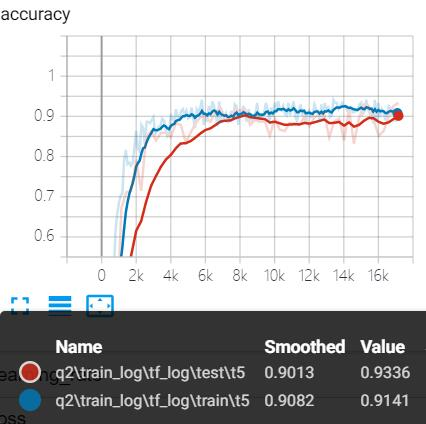&nbsp&nbsp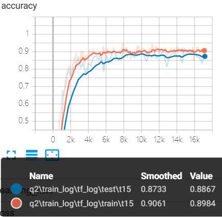&nbsp&nbsp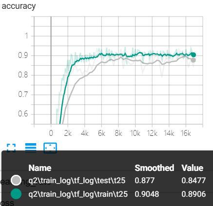 
    <div> T = 5 &nbsp&nbsp&nbsp&nbsp&nbsp&nbsp&nbsp&nbsp&nbsp&nbsp&nbsp&nbsp&nbsp&nbsp&nbsp&nbsp&nbsp&nbsp&nbsp&nbsp&nbsp&nbsp&nbsp&nbsp&nbsp&nbsp&nbsp&nbsp&nbsp&nbsp&nbsp&nbsp T = 15 &nbsp&nbsp&nbsp&nbsp&nbsp&nbsp&nbsp&nbsp&nbsp&nbsp&nbsp&nbsp&nbsp&nbsp&nbsp&nbsp&nbsp&nbsp&nbsp&nbsp&nbsp&nbsp&nbsp&nbsp&nbsp&nbsp&nbsp&nbsp&nbsp&nbsp&nbsp&nbsp T = 25 </div>
    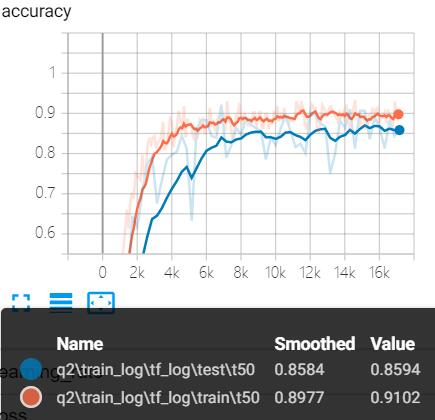&nbsp&nbsp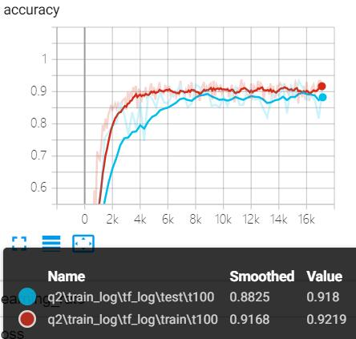
    <div> T = 50 &nbsp&nbsp&nbsp&nbsp&nbsp&nbsp&nbsp&nbsp&nbsp&nbsp&nbsp&nbsp&nbsp&nbsp&nbsp&nbsp&nbsp&nbsp&nbsp&nbsp&nbsp&nbsp&nbsp&nbsp&nbsp&nbsp&nbsp&nbsp&nbsp&nbsp T = 100 </div>
</center>

<center>
    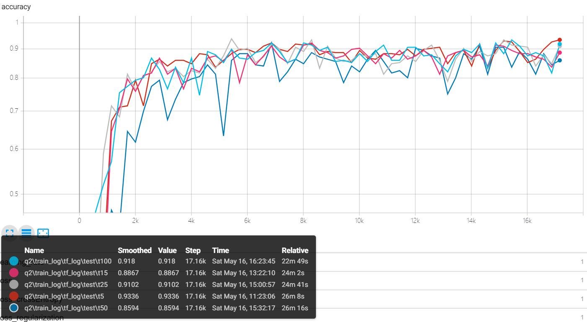
</center>

| Temperture | Test Accuracy |
| ---------- | ------------- |
| T = 5      | 93.36%        |
| T = 15     | 88.67%        |
| T = 25     | 91.02%        |
| T = 50     | 86.94%        |
| T = 100    | 91.8%         |

## 5.3 实验分析

根据公式，可以分析出如下结果：

- $T$ 越接近于 0，则最大的值会越近 1，其它值会接近 0，近似于 $onehot$ 编码。
- $T$ 越高，$softmax$ 的输出越趋于平滑，其分布的熵越大，负标签携带的信息会被相对地放大，模型训练将更加关注负标签。
- $T$ 等于无穷，就是一个均匀分布。

根据实验结果，可以判断：

- 模型的测试精度随着温度 $T$ 的上升，先减小，后增大，再减小增大的波动过程。
- 模型在 $T=5$ 时效果最好，同时在 $T=25,100$ 时也有较为理想的结果。
- baseline 的测试精度为 96.09%，通过调整温度 T，我们可以在降低存储内存的同时减少测试精度的损失。

# 6 增加 hard 交叉熵

> -  We can add 'hard' cross entropy loss with the correct labels in the whole objective loss function as shown below. Notice that the temperature with this loss term should be set as 1. 
>
>    <a href="https://www.codecogs.com/eqnedit.php?latex=Loss&space;=&space;\text{softmax-cross-entropy}(z_i,&space;gt)&space;&plus;&space;c*\text{softmax-cross-entropy}(z_i/T,&space;preds_i)" target="_blank"></a>
>
>    Here   is the  probability generated by the teacher model with temperature T.
>
> - We may set constant c as  to maintain the gradients produced by the 'soft' loss term the same as that of the 'hard' loss.
>
> - Rerun the training process with different temperature.

## 6.1 实验设计

在上一个实验的分析基础上，我们可以将损失函数写成：

$$L=CE(y,p)+\alpha CE(q,p)$$

这里 $CE$ 是交叉熵（Cross Entropy），$y$ 是真实标签的 $onehot$ 编码，$q$ 是教师模型的输出结果，$p$ 是学生模型的输出结果。


按照实验要求：


$c=T^2$ 保证了 $soft$ 和 $hard$ 的反向传播影响相等，同时又改变了 soft 和 hard 的损失函数权重占比。

相应地将代码修改为：

```python
loss = tf.losses.softmax_cross_entropy(label_onehot, logits) 
		+ args.temperature ** 2 * tf.losses.softmax_cross_entropy(
            target_label_onehot, logits / args.temperature) + loss_reg
```

本次实验尝试 5 种温度设置：

$$T=5,15,25,50,100$$

## 6.2 实验结果

<center>
    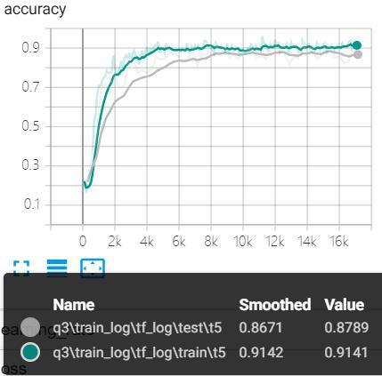&nbsp&nbsp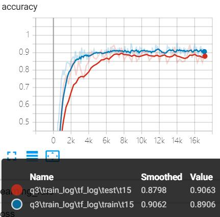&nbsp&nbsp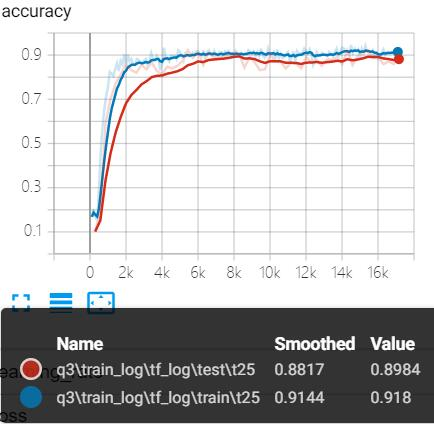 
    <div> T = 5 &nbsp&nbsp&nbsp&nbsp&nbsp&nbsp&nbsp&nbsp&nbsp&nbsp&nbsp&nbsp&nbsp&nbsp&nbsp&nbsp&nbsp&nbsp&nbsp&nbsp&nbsp&nbsp&nbsp&nbsp&nbsp&nbsp&nbsp&nbsp&nbsp&nbsp&nbsp&nbsp T = 15 &nbsp&nbsp&nbsp&nbsp&nbsp&nbsp&nbsp&nbsp&nbsp&nbsp&nbsp&nbsp&nbsp&nbsp&nbsp&nbsp&nbsp&nbsp&nbsp&nbsp&nbsp&nbsp&nbsp&nbsp&nbsp&nbsp&nbsp&nbsp&nbsp&nbsp&nbsp&nbsp T = 25 </div>
    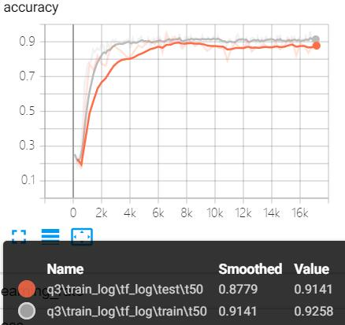&nbsp&nbsp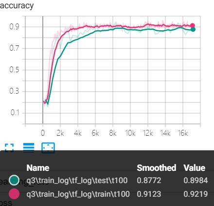
    <div> T = 50 &nbsp&nbsp&nbsp&nbsp&nbsp&nbsp&nbsp&nbsp&nbsp&nbsp&nbsp&nbsp&nbsp&nbsp&nbsp&nbsp&nbsp&nbsp&nbsp&nbsp&nbsp&nbsp&nbsp&nbsp&nbsp&nbsp&nbsp&nbsp&nbsp&nbsp T = 100 </div>
</center>

<center>
    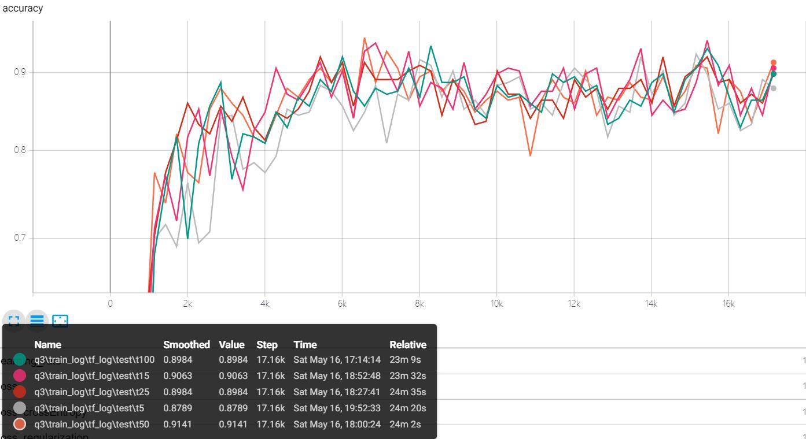
</center>

| Temperture | Test Accuracy |
| ---------- | ------------- |
| T = 5      | 87.89%        |
| T = 15     | 90.63%        |
| T = 25     | 89.84%        |
| T = 50     | 91.41%        |
| T = 100    | 89.84%        |

## 6.3 实验分析

根据实验结果，我们可以得到如下结论：

- $soft$ 加 $hard$ 交叉熵后整体的测试精度相对于单独使用 $soft$ 普遍有细微提升。
- 测试趋势与 Q2 类似，呈现一种上升、下降、上升的波动过程。
- 模型在 $T=50$ 时效果最好，同时在 $T=15$ 时也有较为理想的结果。

# 7 利用 gt 构造 soft 和 hard 交叉熵

> - Instead of distilling quantized models with probabilities from teacher model,  we construct soft cross entropy loss with correct labels. So the loss term becomes as follows, 
>
>   
>
> - Rerun the training process with different temperature.

## 7.1 实验设计

Q2 探讨利用教师模型的预测分类概率训练 $soft$ 交叉熵的效果。

Q3 在 Q2 的基础上加入以 $gt$ 为目标训练出的 $hard$ 交叉熵。

本次实验直接利用 $gt$ 作为 $soft$ 和 $hard$ 交叉熵的训练目标。


相应的代码修改如下：

```python
loss = tf.losses.softmax_cross_entropy(label_onehot, logits) 
		+ args.temperature ** 2 * tf.losses.softmax_cross_entropy(
            label_onehot, logits / args.temperature) + loss_reg
```

本次实验尝试 5 种温度设置：

$$T=5,15,25,50,100$$

## 7.2 实验结果

<center>
    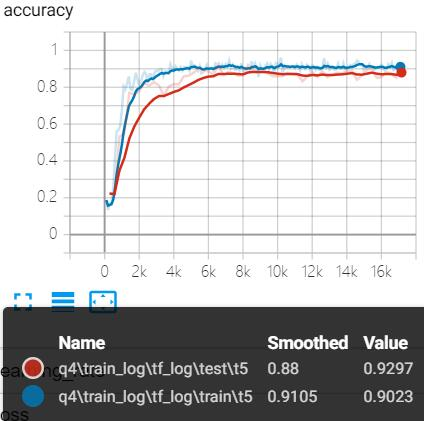&nbsp&nbsp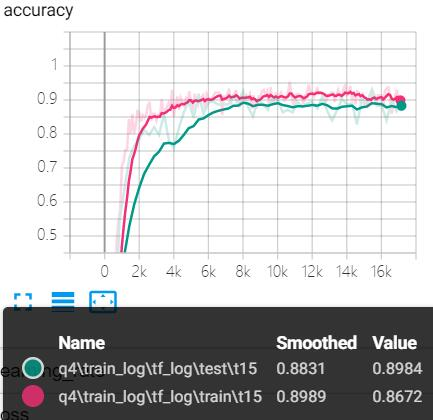&nbsp&nbsp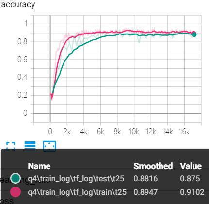 
    <div> T = 5 &nbsp&nbsp&nbsp&nbsp&nbsp&nbsp&nbsp&nbsp&nbsp&nbsp&nbsp&nbsp&nbsp&nbsp&nbsp&nbsp&nbsp&nbsp&nbsp&nbsp&nbsp&nbsp&nbsp&nbsp&nbsp&nbsp&nbsp&nbsp&nbsp&nbsp&nbsp&nbsp T = 15 &nbsp&nbsp&nbsp&nbsp&nbsp&nbsp&nbsp&nbsp&nbsp&nbsp&nbsp&nbsp&nbsp&nbsp&nbsp&nbsp&nbsp&nbsp&nbsp&nbsp&nbsp&nbsp&nbsp&nbsp&nbsp&nbsp&nbsp&nbsp&nbsp&nbsp&nbsp&nbsp T = 25 </div>
    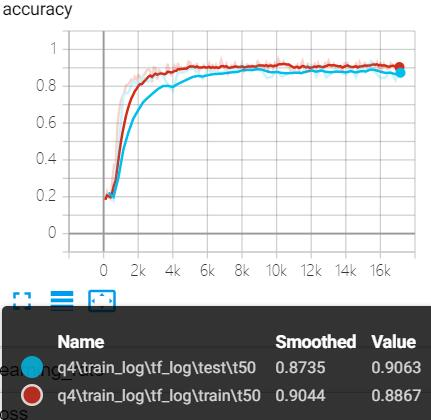&nbsp&nbsp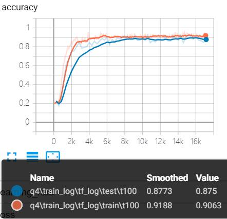
    <div> T = 50 &nbsp&nbsp&nbsp&nbsp&nbsp&nbsp&nbsp&nbsp&nbsp&nbsp&nbsp&nbsp&nbsp&nbsp&nbsp&nbsp&nbsp&nbsp&nbsp&nbsp&nbsp&nbsp&nbsp&nbsp&nbsp&nbsp&nbsp&nbsp&nbsp&nbsp T = 100 </div>
</center>

<center>
    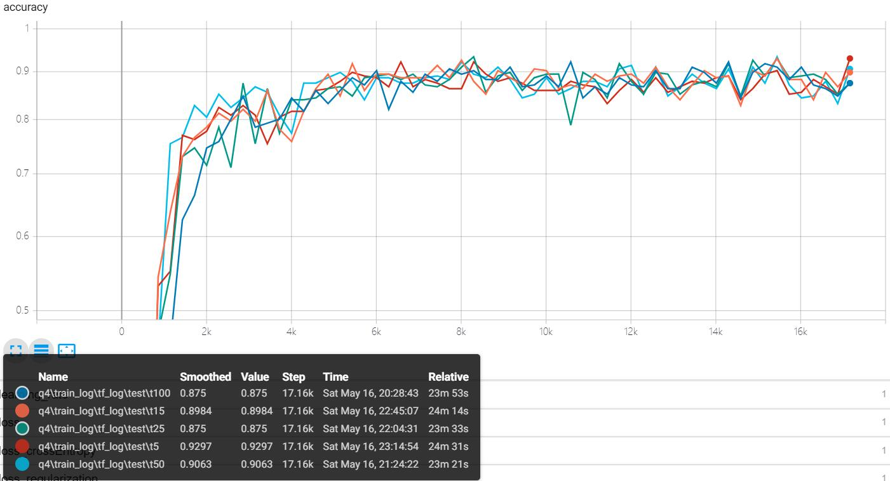
</center>

| Temperture | Test Accuracy |
| ---------- | ------------- |
| T = 5      | 87.89%        |
| T = 15     | 89.84%        |
| T = 25     | 87.50%        |
| T = 50     | 90.63%        |
| T = 100    | 87.50%        |

## 7.3 实验分析

通过实验结果的对比，我们可以得到如下结论：

- 直接利用 $gt$ 作为 $soft$ 和 $hard$ 交叉熵的训练目标，测试精度有细微的下降。
  - 这里存在一定的疑惑，理论上测试精度应该有细微的提高。
- 测试趋势与 Q3 类似，呈现一种上升、下降、上升的波动过程。
- 模型在 $T=50$ 时效果最好，同时在 $T=15$ 时也有较为理想的结果。

# 8 实验总结

- 量化模型减少了模型的参数存储内存，从而加快了模型的训练速度，相应的降低了测试精度，是一种用少量精度换取大量时间和空间的方法。
- 而知识蒸馏可以提高量化模型的测试精度，用来将网络从一个大网络转化成一个小网络，并保留接近于大网络的性能。
