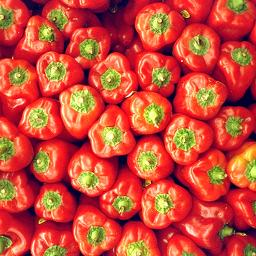

# 深度学习：homework-05-texture-network

## 1 实现环境

- python 3.7.3
- numpy 1.16.1
- opencv-python 4.1.1.26
- tensorflow 1.13.1
- tensorflow-gpu 1.14.0

## 2 背景知识

### 2.1 纹理合成

纹理是由于物体表面的物理属性的多样性而造成的，物理属性不同表示某个特定表面特征的灰度或者颜色信息不同。不同的物理表面会产生不同的纹理图像，因而纹理作为图像的一个极为重要的属性，是图像中特征值强度的某种局部重复模式的宏观表现，在计算机视觉和图像处理中占有举足轻重的地位。

Hawkins 曾经对纹理给出了一个比较详细的描述，他认为纹理有三个主要的标志：

- 某种局部的序列性在比该序列更大的区域内不断重复；
- 序列是由基本元素非随机排列组成的；
- 各部分大致是均匀的统体，在纹理区域内的任何地方都有大致相同的结构尺

上述描述中所说的序列的基本单位通常被称为纹理基元。

纹理合成可以看作是利用随机噪声 $\hat{x}$ 来近似真实纹理图片的过程，通过对 $\hat{x}$ 进行训练和优化，直到从深度神经网络中提取的特征具有与源纹理图像 $x$ 相同的统计量，由于纹理的每个定义都是固定的， 所以特征的统计数据应该与空间信息无关。

### 2.2 Gram 矩阵

在本实验中，我们使用 $Gram$ 矩阵来描述源纹理图像和生成纹理图像的空间不可知统计量。

$Gram$ 矩阵是计算每个通道 i 的 feature map 与每个通道 j 的 feature map 的内积。 $Gram$ 矩阵的每个值可以说是代表 i 通道的 feature map 与 j 通道的 feature map 的互相关程度。使用 $Gram$ 矩阵的，就是为了度量各个维度自己的特性以及各个维度之间的关系。

将 $Gram$ 矩阵定义为特征不同通道之间的相关性，其公式为：


其中，$F^l_{i,m,n}$ 表示第 $l$ 层、第 $i$ 个特征图的 $(m,n)$ 像素点。

这个矩阵的含义是：同一层级 conv 的不同特征之间的像素值点乘然后累加，得到的是每两个不同特征图之间的相关系数值。 

相应地，构建损失函数为：


其中，$G\hat{G}$ 表示纹理图像与生成图像的 $Gram$ 矩阵，$N_lM_l$ 表示第 $l$ 层特征图的像素总数，$u_l$ 表示第 $l$ 层的权重 (在 Baseline 代码中，我们对所有层都设置为 1)。 

公式中除以 $M^2N^2$ 是保证 $Loss$ 对每个像素的改变与像素值在同一个数量级上。

### 2.3 实验图像

下列是本次实验测试的 4 张图片：

<center class="half">
    &nbsp
    </br>
    &nbsp
</center>  

前两张是纹理图片，后两张是非纹理图片。

## 3 实现 Gram 矩阵和 Loss 函数

> Use the features extracted from all the 13 convolution layers,  complete the baseline project with loss function based on gram matrix and run the training process.

### 3.1 实验设计

#### 3.1.1 Gram 矩阵

 $Gram$ 矩阵公式为：


其中，$F^l_{i,m,n}$ 表示第 $l$ 层、第 $i$ 个特征图的 $(m,n)$ 像素点。

相应代码如下：

```python
def get_gram_matrix(feature_map):
    shape = tf.shape(feature_map)
    reshape_feature = tf.reshape(feature_map, shape=(-1, shape[3]))
    transpose_feature = tf.transpose(reshape_feature)
    return tf.matmul(transpose_feature, reshape_feature) / tf.cast((2 * shape[1] * shape[2]), tf.float32)
```

我对公式做了一定改动：

- `tf.cast((2 * shape[1] * shape[2]), tf.float32)` 是 $Loss$ 函数中的标准化项，我将它提到了矩阵生成函数中。
- `shape[1] * shape[2] == M`，没有除以 $N$ 的原因见下文。

#### 3.1.2 Loss 函数

$Loss$ 函数为：


其中：

- $G\hat{G}$ 表示纹理图像与生成图像的 $Gram$ 矩阵；
- $N_lM_l$ 表示第 $l$ 层特征图的像素总数；
- $u_l$ 表示第 $l$ 层的权重。 

```python
def get_l2_gram_loss_for_layer(noise, source, layer):
    noise_gram = get_gram_matrix(getattr(noise, layer))
    source_gram = get_gram_matrix(getattr(source, layer))
    return config.gram_weight * tf.reduce_sum(tf.square(noise_gram - source_gram))
```

我在 `common.py` 中，定义了 `gram_weight`，在 Baseline 代码中，我们对所有层都设置为 1。

### 3.2 实验结果

一开始我使用的是原版公式，即除以 $M^2N^2$ 保证 $Loss$ 对每个像素的改变与像素值在同一个数量级上，效果如下：

<center>
    &nbsp&nbsp&nbsp
	<div>Original &nbsp&nbsp&nbsp&nbsp&nbsp&nbsp&nbsp&nbsp&nbsp&nbsp&nbsp&nbsp&nbsp&nbsp&nbsp&nbsp&nbsp&nbsp&nbsp&nbsp&nbsp&nbsp&nbsp&nbsp&nbsp&nbsp&nbsp&nbsp&nbsp&nbsp&nbsp Generated</div>
    &nbsp&nbsp&nbsp  
    <div>Original &nbsp&nbsp&nbsp&nbsp&nbsp&nbsp&nbsp&nbsp&nbsp&nbsp&nbsp&nbsp&nbsp&nbsp&nbsp&nbsp&nbsp&nbsp&nbsp&nbsp&nbsp&nbsp&nbsp&nbsp&nbsp&nbsp&nbsp&nbsp&nbsp&nbsp&nbsp Generated</div>
</center>

可以看出，生成图片的效果并不好。经过对训练过程中 $Loss$ 的分析，怀疑问题可能在于 $Loss$ 过小，于是开始尝试修改分母 $M^2N^2$。经过实验，发现在分母为 $M^2$ 时，实验效果最好，结果如下：

<center>
    &nbsp&nbsp&nbsp
	<div>Original &nbsp&nbsp&nbsp&nbsp&nbsp&nbsp&nbsp&nbsp&nbsp&nbsp&nbsp&nbsp&nbsp&nbsp&nbsp&nbsp&nbsp&nbsp&nbsp&nbsp&nbsp&nbsp&nbsp&nbsp&nbsp&nbsp&nbsp&nbsp&nbsp&nbsp&nbsp Generated</div>
    &nbsp&nbsp&nbsp  
    <div>Original &nbsp&nbsp&nbsp&nbsp&nbsp&nbsp&nbsp&nbsp&nbsp&nbsp&nbsp&nbsp&nbsp&nbsp&nbsp&nbsp&nbsp&nbsp&nbsp&nbsp&nbsp&nbsp&nbsp&nbsp&nbsp&nbsp&nbsp&nbsp&nbsp&nbsp&nbsp Generated</div>
</center>

### 3.3 实验分析

$Gram$ 矩阵可以看做是 feature 之间的偏心协方差矩阵（$Gram$ 矩阵没有白化，也就是没有减去均值，直接使用两向量做内积），用于度量各个维度自己的特性以及各个维度之间的关系。内积之后得到的多尺度矩阵中，对角线元素提供了不同特征图各自的信息，其余元素提供了不同特征图之间的相关信息。这样一个矩阵，既能体现出有哪些特征，又能体现出不同特征间的紧密程度。

对于去除分母中的 $N^2$ 能提高生成图像的效果，我有如下猜测：

- 本实验针对输入图像做了归一化处理，像素压缩到了 $[0,1]$，使得 $Loss$ 在进一步标准化时压缩得过小，无法完成较好的反向传播。

后续实验以分母没有 $N^2$ 的模型为 baseline。

## 4 使用非纹理图片训练

> To better understand texture model represents image information, choose another non-texture image(such as robot.jpg in the ./images folder) and rerun the training process. 

### 4.1 实验设计

本次实验的非纹理图片为仓库提供的机器人图片（robot）和行人图片（shibuya）。

可以看出，这些图片没有局部纹理信息，整体非常光滑。

### 4.2 实验结果

<center>
    &nbsp&nbsp&nbsp
	<div>Original &nbsp&nbsp&nbsp&nbsp&nbsp&nbsp&nbsp&nbsp&nbsp&nbsp&nbsp&nbsp&nbsp&nbsp&nbsp&nbsp&nbsp&nbsp&nbsp&nbsp&nbsp&nbsp&nbsp&nbsp&nbsp&nbsp&nbsp&nbsp&nbsp&nbsp&nbsp Generated</div>
    &nbsp&nbsp&nbsp  
    <div>Original &nbsp&nbsp&nbsp&nbsp&nbsp&nbsp&nbsp&nbsp&nbsp&nbsp&nbsp&nbsp&nbsp&nbsp&nbsp&nbsp&nbsp&nbsp&nbsp&nbsp&nbsp&nbsp&nbsp&nbsp&nbsp&nbsp&nbsp&nbsp&nbsp&nbsp&nbsp Generated</div>
</center>


明显看出，生成的图片并没有成功提取源图片的纹理特征。

### 4.3 实验分析

对于非纹理图片，模型生成的过程中会将特征信息打散然后任意组合，出现以上情况，由此可判断本模型适用于有纹理的照片。

## 5 使用更少的卷积层训练

> The baseline takes the features from all the convolutional layers, which involves a large number of  parameters. To reduce the parameter size,  please use less layers for extracting features (based on which we compute the Gram matrix and loss) and explore a combination of layers with which we can still synthesize texture images with high degrees of naturalness.

### 5.1 实验设计

baseline 中，我们是对所有的卷积层都计算 $Gram$ 矩阵和 $Loss$ 函数，效果显著：

下面尝试使用更少的卷积层进行训练，我设计了如下几种方案：

1. 使用第一组卷积：
   - `GRAM_LAYERS = ['conv1_1', 'conv1_2']`
2. 使用前两组卷积：
   - `GRAM_LAYERS = ['conv1_1', 'conv1_2', 'conv2_1', 'conv2_2']`
3. 使用前三组卷积：
   - `GRAM_LAYERS = ['conv1_1', 'conv1_2', 'conv2_1', 'conv2_2', 'conv3_1', 'conv3_2', 'conv3_3']`
4. 使用前四组卷积：
   - `GRAM_LAYERS = ['conv1_1', 'conv1_2', 'conv2_1', 'conv2_2', 'conv3_1', 'conv3_2', 'conv3_3', 'conv4_1', 'conv4_2']`
5. 使用后两组卷积：
   - `GRAM_LAYERS = ['conv4_1', 'conv4_2','conv4_3', 'conv5_1', 'conv5_2', 'conv5_3']`
6. 每组使用一层卷积：
   - `GRAM_LAYERS = ['conv1_1', 'conv2_1', 'conv3_1', 'conv4_1', 'conv5_1']`

### 5.2 实验结果

<center>
    &nbsp&nbsp&nbsp&nbsp
    <div>使用第一组 &nbsp&nbsp&nbsp&nbsp&nbsp&nbsp&nbsp&nbsp&nbsp&nbsp&nbsp&nbsp&nbsp&nbsp&nbsp&nbsp&nbsp&nbsp&nbsp&nbsp&nbsp&nbsp 使用前两组 &nbsp&nbsp&nbsp&nbsp&nbsp&nbsp&nbsp&nbsp&nbsp&nbsp&nbsp&nbsp&nbsp&nbsp&nbsp&nbsp&nbsp&nbsp&nbsp&nbsp&nbsp&nbsp 使用前三组</div>
    &nbsp&nbsp&nbsp&nbsp&nbsp&nbsp
    <div>Original &nbsp&nbsp&nbsp&nbsp&nbsp&nbsp&nbsp&nbsp&nbsp&nbsp&nbsp&nbsp&nbsp&nbsp&nbsp&nbsp&nbsp&nbsp&nbsp&nbsp&nbsp&nbsp&nbsp&nbsp&nbsp&nbsp&nbsp&nbsp&nbsp&nbsp&nbsp&nbsp baseline</div>
    &nbsp&nbsp&nbsp&nbsp
    <div>使用前四组&nbsp&nbsp&nbsp&nbsp&nbsp&nbsp&nbsp&nbsp&nbsp&nbsp&nbsp&nbsp&nbsp&nbsp&nbsp&nbsp&nbsp&nbsp&nbsp&nbsp&nbsp&nbsp 使用后两组&nbsp&nbsp&nbsp&nbsp&nbsp&nbsp&nbsp&nbsp&nbsp&nbsp&nbsp&nbsp&nbsp&nbsp&nbsp&nbsp&nbsp&nbsp&nbsp&nbsp&nbsp&nbsp 每组使用一层</div>
</center>


可以看出：

- 使用前三组、前四组、每组使用一层的效果较好，与 baseline 接近。
- 使用第一组、前两组仅能提取出一定的纹理和局部信息。
- 使用后两组仅能提取出明显的轮廓，而无法提取出明显的纹理。

### 5.3 实验分析

根据实验结果，我们可以做出如下推测：

- 浅层卷积提取的是图像的抽象信息，能得到较好的纹理特征；
- 深层卷积提取的是图像的细节信息，能得到较好的轮廓特征；
- 单纯依靠浅层或者深层，都不能得到一个良好的效果；
- 保证深浅卷积层同时存在，减少卷积层的数量，综合纹理的抽象信息和细节信息，能得到和 baseline 相近的效果。

故本实验最终选择第 6 中方案，即每组使用一层卷积：

- `GRAM_LAYERS = ['conv1_1', 'conv2_1', 'conv3_1', 'conv4_1', 'conv5_1']`

将卷积层从 13 层减少到 5 层。

## 6 寻找 Gram 矩阵的替代方式

> We may use the Earth mover's distance between the features of source texture image and the generated image. You may sort the pixel in each feature map of the generated image and the original image and compute their L2 distance to construct the loss, which is shown as below(For rationality of this equivalence please check [here](https://pdfs.semanticscholar.org/194c/2eec28f70ac7da28c7d9f73f65351a181df2.pdf)), where  is the feature map of the original image and the generated image.

### 6.1 实验设计

$Earth\ \ mover’s\ \ distance（EMD）$为归一化的从一个分布变为另一个分布的最小代价，该指标可以用来测量两个分布之间的距离，其公式如下：


其中：

- $sorted(F_i)$ 表示特征图中经过排序后的第 $i$ 个像素。
- $w_l$ 表示第 $l$ 层的权重。

```python
def get_l2_EMD_loss_for_layer(noise, source, layer):
    shape = tf.shape(getattr(noise, layer))
    noise_transpose = tf.transpose(tf.reshape(getattr(noise, layer), shape=(-1, shape[3])))
    noise_sort = tf.nn.top_k(noise_transpose, shape[1] * shape[2])[0]
    source_transpose = tf.transpose(tf.reshape(getattr(source, layer), shape=(-1, shape[3])))
    source_sort = tf.nn.top_k(source_transpose, shape[1] * shape[2])[0]
    return config.gram_weight * tf.reduce_sum(tf.square(noise_sort - source_sort))
```

### 6.2 实验结果

<center>
    &nbsp&nbsp&nbsp&nbsp
	</br></br>
    &nbsp&nbsp&nbsp&nbsp 
    <div>Gram-Generated &nbsp&nbsp&nbsp&nbsp&nbsp&nbsp&nbsp&nbsp&nbsp&nbsp&nbsp&nbsp&nbsp&nbsp&nbsp&nbsp&nbsp&nbsp&nbsp&nbsp&nbsp&nbsp&nbsp&nbsp Original &nbsp&nbsp&nbsp&nbsp&nbsp&nbsp&nbsp&nbsp&nbsp&nbsp&nbsp&nbsp&nbsp&nbsp&nbsp&nbsp&nbsp&nbsp&nbsp&nbsp&nbsp&nbsp&nbsp&nbsp EMD-Generated</div>
</center>

对于纹理图片，$EMD$ 也能得到基本的纹理特征，但对比 $Gram$ 矩阵，它的整体效果较差，同时清晰度也较低。

<center>
    &nbsp&nbsp&nbsp&nbsp
	</br></br>
    &nbsp&nbsp&nbsp&nbsp 
    <div>Gram-Generated &nbsp&nbsp&nbsp&nbsp&nbsp&nbsp&nbsp&nbsp&nbsp&nbsp&nbsp&nbsp&nbsp&nbsp&nbsp&nbsp&nbsp&nbsp&nbsp&nbsp&nbsp&nbsp&nbsp&nbsp Original &nbsp&nbsp&nbsp&nbsp&nbsp&nbsp&nbsp&nbsp&nbsp&nbsp&nbsp&nbsp&nbsp&nbsp&nbsp&nbsp&nbsp&nbsp&nbsp&nbsp&nbsp&nbsp&nbsp&nbsp EMD-Generated</div>
</center>


对于非纹理图片，$EMD$ 与 $Gram$ 矩阵的效果没有明显差异。

### 6.3 实验分析

根据实验结果，我们可以得到如下结论：

- 从生成的图片看，$EMD$ 能得到基本的纹理特征，该方法是有效的，但是其效果不如 $Gram$ 矩阵。
- 从训练过程看，$EMD$ 的速度稍慢，不如 $Gram$ 矩阵。
- $EMD$ 可以作为 $Gram$ 矩阵的替代，但并不是一个很好的选择。

## 7 不同卷积层使用不同的权重训练

> Use the configuration in Q3 as baseline. Change the weighting factor of each layer and rerun the training process.

### 7.1 实验设计

在 $Loss$ 函数中：


$u_l$ 表示第 $l$ 层的权重，在 Baseline 代码中，我们对所有层都设置为 1。

下面尝试针对不同层使用不同的权重来训练，我设计了如下方案：

- 权重逐渐减小
  - 以卷积结果的深度作为权值影响因子；
  - 以卷积层在网络中的位置作为权值影响因子；
- 权重逐渐增大
  - 以卷积结果的大小作为权值影响因子；
  - 以卷积层在网络中的位置作为权值影响因子；

```python
def get_l2_gram_loss_for_layer(noise, source, layer):
    noise_gram = get_gram_matrix(getattr(noise, layer))
    source_gram = get_gram_matrix(getattr(source, layer))
    weight = # TODO
    return weight * tf.reduce_sum(tf.square(noise_gram - source_gram))
```

以卷积层在网络中的位置作为权值影响因子：

- 权重逐渐减小：` weight = (1 - GRAM_LAYERS.index(layer) / len(GRAM_LAYERS)) ** 2`
- 权重逐渐增大： `weight = ((GRAM_LAYERS.index(layer) + 1) / len(GRAM_LAYERS)) ** 2`

以卷积结果的通道数作为权值影响因子:

- 权重逐渐减小：` weight = config.gram_weight / shape[3]`

以卷积结果的大小作为权值影响因子:

- 权重逐渐增大： `weight = ((GRAM_LAYERS.index(layer) + 1) / shape[1]`

### 7.2 实验结果

<center>
    &nbsp&nbsp&nbsp&nbsp
	<div>Original &nbsp&nbsp&nbsp&nbsp&nbsp&nbsp&nbsp&nbsp&nbsp&nbsp&nbsp&nbsp&nbsp&nbsp&nbsp&nbsp&nbsp&nbsp&nbsp&nbsp&nbsp&nbsp&nbsp&nbsp&nbsp&nbsp&nbsp&nbsp 增大(high) &nbsp&nbsp&nbsp&nbsp&nbsp&nbsp&nbsp&nbsp&nbsp&nbsp&nbsp&nbsp&nbsp&nbsp&nbsp&nbsp&nbsp&nbsp&nbsp&nbsp&nbsp&nbsp&nbsp&nbsp&nbsp&nbsp&nbsp&nbsp 增大(level)</div>
    &nbsp&nbsp&nbsp&nbsp 
    <div>baseline &nbsp&nbsp&nbsp&nbsp&nbsp&nbsp&nbsp&nbsp&nbsp&nbsp&nbsp&nbsp&nbsp&nbsp&nbsp&nbsp&nbsp&nbsp&nbsp&nbsp&nbsp&nbsp&nbsp&nbsp&nbsp&nbsp&nbsp&nbsp 减小(channel) &nbsp&nbsp&nbsp&nbsp&nbsp&nbsp&nbsp&nbsp&nbsp&nbsp&nbsp&nbsp&nbsp&nbsp&nbsp&nbsp&nbsp&nbsp&nbsp&nbsp&nbsp&nbsp&nbsp&nbsp&nbsp&nbsp&nbsp&nbsp 减小(index)</div>
</center>


可以看出：

- 深层卷积权重大的模型，效果好于浅层卷积权重大的模型。
- 深层卷积权重大的模型，效果好于卷积权相同的模型。

故随着网络加深而权重递增的模型效果最好。

### 7.3 实验分析

通过实验结果的对比，结合 Q3，我们可以猜测：

- 浅层卷积更侧重整体结构；

- 深层卷积更侧重局部细节；
- 浅层卷积对整体结构的影响不需要赋予较大的权重就能得到很好的效果，而深层卷积对局部细节的影响需要较大的权重才能得到很好的效果；
- 深层卷积对图像纹理效果的贡献更大。

